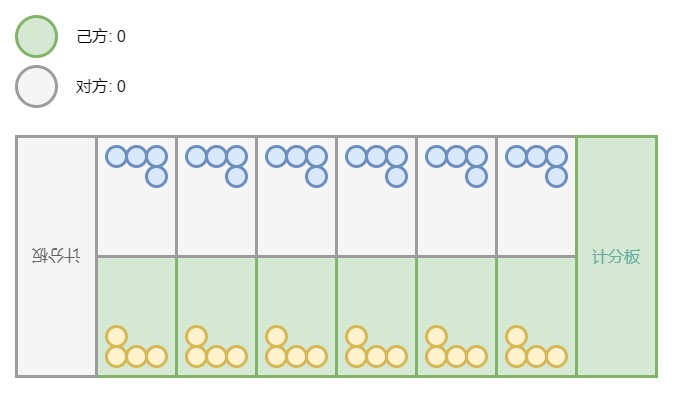
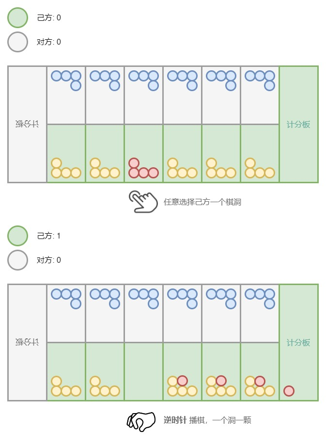
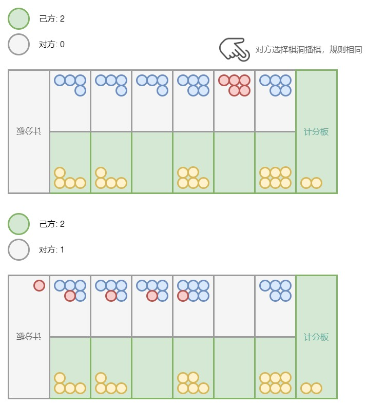

# 2024 年北航敏捷软工结对项目：播棋・the・Rock！

## 前言

**欢迎来参加 2024 年北航计算机学院敏捷软工的结对编程项目！🎉**

结对编程项目的设计，意在为大家提供相对陌生的问题背景和技术场景，从而促使大家在相对集中的工作时间内和伙伴一起活用各自的经验和知识，完成一次结对编程、极限编程的体验。

### 任务的构成

#### 需要完成的任务

##### 编程实现

**⚠️ 请在开始结对编程项目之前，fork 本项目代码仓库。**

在接下来的任务描述中，会出现标注为类似 **🧑‍💻 T1.1** （依序编号，可能含子任务）的编程任务，每一个编程任务会对应本代码仓库下的一个文件夹，例如 `/T1` 对应代码实现任务 `T1.x` 的内容。

相关编码实现请在本仓库的基础上进行。

##### 对问题的作答

在接下来的任务描述中，会出现标注为类似 **📖 Q1.1(P/I)** （依序编号，可能含子任务）的问题。

标记为 **(P)** 的问题，需要两个人经过**相互讨论**给出**共同的答案**：体现在提交的博客中，相关内容两个人的答案**相同**。

标记为 **(I)** 的问题，需要两个人经过**独立思考**给出**各自的答案**：体现在提交的博客中，相关内容两个人的答案**不同**。

请依照任务指导在完成结对编程项目的**同时**，作答各项问题。

**问题列表位于：仓库的 `question.md` 文件，请不要将本文档内的作答提交到代码仓库。**

#### 需要提交的项目

##### 代码仓库

每组（两人）**只需提交一份**，仓库至少在课程结束前开源在主流代码托管平台（例如 GitHub、Gitee、GitCode 等）。

##### 博客文档

每组（两人）**需要各自提交一份**，并发表在课程 CSDN 社区。**博客的内容即为对应 `question.md` 文件两人各自的内容。**

### 项目的预想和要求

#### 限时完成

本项目设计上是一个**限时**完成的项目，课程组对项目的预想总完成时间（包括编码、编码时简单作答的时间，不包括思考、后续依个人情况完善作答等难以界定的时间）为 **10 小时**。希望大家尽量确保**连贯、成块**的时间完成本结对编程项目，单次保证**至少 1~2 小时**的投入，**推荐尽量一次至少完成一个章节**。

因此，对每项任务，会提供课程组的预期实现时间供参考；同时，会**要求记录每项任务的开始时间和结束时间**，相关时间记录**应当和代码仓库的 commit 记录相对应**。

**如果中间有所中断，请诚实地记录每个分段的起止时间。**

对时间的要求并不会影响得分，大家如实记载即可。**一种情况例外：**由于本项目包含对各位的代码实现进行“比较”、确定“性能分”的部分，有意采用远远超出时限的大工作量来取得更好性能的工作不会获得合理工时工作以上的得分。

#### 结对完成

本项目应当以结对编程的形式完成。具体来说，期望大家采取两人线下（或线上）的方式，在一台机器上，一边讨论、一边工作，一位成员担当“驾驶员”、另一位成员担当“导航员”。

**🚫 请不要采用对任务进行分解、两位成员互不沟通而各自完成某一部分的方式来完成本项目。**

#### 体验优先

本项目是重视体验、而非重视结果的设计，除去占比 20% 的性能分部分，均不涉及完成结果之间的对比。余下分数以编程实现完成既定目标为主，未能达标也会根据大家的体验情况和项目投入给出较为合理（一般不低于相关任务满分 60%）的评分—— 所谓大家的“投入”，是指在博客/问题作答中体现出的结对过程。

#### 课程评价的组成

本项目的设计总分为 150 分。

| 项目                                       | 分数占比 | 预计耗时 |
| ------------------------------------------ | -------- | -------- |
| 博客文档（对各问题的回答）                 | 50 分    | /        |
| 编程任务第一部分（Wasm 入门）              | 20 分    | 120 min  |
| 编程任务第二部分（主需求一：不涉及性能分） | 40 分    | 180 min  |
| 编程任务第三部分（主需求二：涉及性能分）   | 40 分    | 300 min  |

> 那么，请和你的搭档坐在一起，开始吧！

## 结对项目：播棋・the・Rock！

### Chapter.1 缠结的字节码（Bytecode Complex）

> ⏲️ 本章内容的参考完成时间为 120 分钟。

如何在 Web 场景中，为多种编程语言提供统一的运行环境而尽可能地利用其语言设计本身、工具链和生态环境所带来的效能优势？

——**噔噔咚！**突然问这样的问题实在是很生硬的引入，一般而言谁会去想啦！但是这里是**极限编程的结对项目**，请和你的搭档一起让大脑**活跃起来**——之后会一直保持这样的节奏！准备好 `question.md`，**在代码仓库外复制一份**，请边阅读边填写入**代码仓库外的版本**，或采取简记、语音备忘等方式记载较复杂问题的要点之后再补充。那么首先——

> **→ 📖 Q1.1(P) 请记录下目前的时间。**

#### “不会飞”的 Web

回到一开始的问题，或许大家很容易会想到 “😠 聊这个我可就不困了！JS，我讨厌你！” JS 作为 Web 开发的某种意义上的标准语言，在以其敏捷、多范式等等设计特点创建并不断发展 Web 生态的同时，也在通过标准化、编程语言本身及编译器和运行时的发展而不断演进。Web 应用的开发范式高速迭代，和软件工程领域的最前端紧密相连——时至今日，Web 浏览器引擎本身就已成为一套统一的运行环境和交互接口：从 ChromeOS 到小程序、再到诸如 Typora、VSCode、QQ、[2023 年敏捷软工团队项目 Ficus](https://github.com/Thysrael/Ficus) 等等各种各样基于 Electron 的桌面应用......似乎从某一天开始，万事万物都可以“运行在浏览器里”。

然而！这并不像听起来那样美好得理所应当——即便 Google、Mozilla、Apple 等等企业和来自开源社区的力量日复一日地使用各类手段来优化其 JS 运行时的性能，似乎我们还是比想象中更快地到达了瓶颈。JS 语言以及 Web 生态的既有特性使得 Web 开发环境不成比例地倾斜向开发效率而非执行效率，而 Web 场景新的边界正将对性能的企盼以及那些沉疴痼疾不断地向外扩散——人们开始要求在浏览器里运行一段复杂的图形学算法、一个神经网络模型、又或者一个紧凑的模拟器。

**等等！**你当然会想“那倒是去像我们美好的过去一样，下载原生（Native）构建的软件、安装到自己的电脑上运行啊！”从开发者的角度来想，很容易观察到不同执行环境带来的额外适配成本、跨平台软件构建的开销复杂化了开发和分发，舍弃 Web 开发生态的诸多范式（例如，使用 Web 前端框架构建用户交互界面在跨平台场景下相较去和不同平台各自为政的 UI Kit 打交道，前者往往能更简便地实现统一的用户体验）更带来了许多头疼的问题；从用户的角度来想，能够通过网络分发的软件服务却要多执行一次和操作环境息息相关的安装过程，继而面临许多纷至沓来的问题——无论是使用一次还是使用多次、无论是在公用的设备还是私有的设备上......怎么想都很完蛋！Web 对软件开发及使用范式的改变如同打开的潘多拉魔盒，**已经回不去了！**

——幸运而不幸地，Web 已经将我们紧密缠结在了一起。

#### 那条“纽带”

要是能结合 Web 和 Native 的优点就好了！一定会这样想。

> **→ 📖 Q1.2(P) 那么首先问问你！根据之前学习的专业课和各类开发经验，为什么原生应用相较 Web app 更有快的印象呢？这样的“速度”又是如何达成的呢？先不要阅读后文、和搭档头脑风暴一下想到什么回答什么就好！**

学过编译原理课的大家容易想到，一种良好设计的编程语言，可以与充分利用其语言特性实现多种优化可能的编译器一起，达成更好的性能表现；操作系统课程揭示了我们开发的程序如何通过多个层次与 OS 交互，进而以高效的方式利用设备的硬件资源；各类专业课的经验会让我们意识到每种编程语言、每种开发范式有它自己的生态与擅长的任务......

基于所有这些思考，面对这样一个软件工程问题：“要让 Web 生态、或者说一种雄心勃勃的软件运行环境的未来，受益于既有的‘原生’软件开发模式、技术栈和工具链，我们还缺少什么？”——

> **→ 📖 Q1.3(P) 你们的答案是？**

由 W3C 及 Mozilla、Microsoft、Google、Apple、Fastly、Intel、Red Hat 等企业提供的一种答案是，通过定义一套二进制指令格式（基本上可以说：一套字节码设计规范）和对应的基于栈式虚拟机的运行时设计规格、以及相关基础设施及生态工具链的设计协议来提供一种 Web 原生的解决方案。

这便是本项目（技术上）的主角——**WebAssembly🎉**！

开源社区、企业——尤其是以 Web 生态相关企业为中心的字节码联盟（Bytecode Alliance）进而根据这些方案去实现相关的工具链，包括提供运行时、开发工具链的实现、完成对上下游的适配等等。

**也许还是有些云里雾里！**简单来说，就是定义一套综合考虑多种编程语言设计的、较低层级的统一字节码，上游对接各类编程语言——实现一套编译器后端将各类语言编译为 WebAssembly（缩短一点，Wasm！）字节码，下游对接目前的 Web 运行时——实现浏览器引擎的 Wasm 执行能力、或者更激进一些实现脱离浏览器的独立 Wasm 运行时。这样的好处显而易见——我们可以在 Web 生态中整合多种编程语言、生态系统、开发工具和开发范式的优势了！**eg.** C/C++ 语言和工具链能够适应某些更性能敏感任务的开发需要，那么我们就用 C/C++ 来实现，然后编译到 Wasm 并在既有的（主要基于 JS 的）代码库基础上通过调用 Wasm 运行时来使用它，进而得益于这种性能提升！

得益于一套统一的基础，对更多编程语言及其生态的支持也就得以花费相对小的成本进行。

在接下来的任务中，我们将通过一次简单的尝试来入门 Wasm！

#### 来了！出发吧——

> **→ 📖 Q1.4(I) 【你可以在结对结束后另行补充。】作为本项目的调查：**
>
> 请如实标注在开始项目之前对 Wasm 的熟悉程度分级，可以的话请细化具体的情况。（分别回答两人各自的情况）
>
> I. 没有听说过；
>
> II. 仅限于听说过相关名词；
>
> III. 听说过，且有一定了解；
>
> IV. 听说过，且使用 Wasm 实际进行过开发（即便是玩具项目的开发）。

> **→ 📖 Q1.5(P) 请在完成任务的同时记录，并在完成任务后整理完善：**
>
> 完成编程任务期间，你和你的搭档依次做了什么，比如：
>
> 1. 查阅了什么资料；
> 2. 如何进行了开发；
> 3. 遇到了什么问题，又通过什么方式解决。

> **→ 🧑‍💻 T1 Wasm 初见！**
>
> 请根据以下要求及参考资料，完成任务。
>
> 本任务的全部源代码应该存放于 `/T1`。
>
> 代码有进展即进行 `commit`，`commit log` 不合理的项目会被助教抽查询问项目细节。

##### Wasm 与编程语言和工具链

接下来的任务需要你和你的搭档：

1. 使用任意语言编程实现列出的需求；
2. 使用相关工具链将代码编译到 Wasm；
3. 使用相关工具链生成或手工编写 JS 胶水代码，导出封装好的 Wasm 中你实现的函数；
4. 调试代码，确保你的实现能够对接课程组提供的测试用 JS 代码，这些代码将在 **Node.js 的当前 LTS 版本**运行时上运行。

由于目前支持 Wasm 作为编译目标的编程语言及工具链种类繁多，你可以参照 [Wasm 官方文档 ](https://webassembly.org/getting-started/developers-guide/)选择支持的语言进行尝试。**代码实现只要能通过课程组提供的提交测试 JS 代码，都可以接受作为提交。**然而，为了降低实践难度，课程组为以下两种编程语言提供额外的支持。你的选择对项目进行的影响如下表所示：

| 所选用的编程语言                                             | 课程组支持情况                         | 对任务的影响                             | 对评价的影响                                                 |
| ------------------------------------------------------------ | -------------------------------------- | ---------------------------------------- | ------------------------------------------------------------ |
| [AssemblyScript](https://www.assemblyscript.org/)            | 支持：提供资料                         | 任务设计的难度基线                       | 对评分无影响                                                 |
| [Rust](https://www.rust-lang.org/)                           | 支持：提供资料                         | 较基线难度略微多提供一些提示             | 对评分无影响                                                 |
| [能够完成需求的其他编程语言](https://webassembly.org/getting-started/developers-guide/) | 不提供参考资料支持，需要自行了解和学习 | **挑战性的：**需要自行解决可能遇到的问题 | 如果采用其他编程语言完成所有任务，获得分值为 10 分的结对项目**附加分** |

**请注意，对编程语言及工具链的选择，可能影响程序实现的性能表现。**

##### 引入任务：「幽灵唯我一人」

###### 要求

请实现一个函数：

- 函数名：`bocchiShutUp()` 或者 `bocchi_shut_up()` etc.，根据你选择的编程语言选择合适的命名格式；
- 参数：
  - 一个 i32 类型数字 `flag`，为 `1` 或 `2`；
  - 一个 i32 类型数组 `seq`，包含若干介于 `[11,16]` 或 `[21,26]` 间的两位数数字；
  - 一个 i32 类型数字 `size`，为数组 `seq` 的元素个数。
- 返回值：一个 i32 类型数字。
- 行为：
  - 检查 `flag`：
    - 如果 `flag` 为 `1`，统计 `seq` 中十位数为 `1` 的各数的出现频次，例如：`11` 出现了 `5` 次，`12` 出现了 `4` 次，etc.
    - 如果 `flag` 为 `2`，类似统计 `seq` 中十位数为 `2` 的各数的出现频次；
  - 统计的数中，出现频次最大的数是“👻幽灵”：
    - 如果只有一个“👻幽灵”，返回这个数；
    - 如果有多个“👻幽灵”，返回 `10`。

###### 测试

`/T1` 下提供了测试代码，你可以参照后文的指引来配置并运行提供的简单测试，**实际评测时所使用的数据有所不同。**

##### Instruction!!

本部分包含针对不同编程语言及工具链选择的指引，请根据你的选择来完成接下来的任务。**对于问答环节，你只需要完成你选择的部分的问题：例如，如果你选择 AssemblyScript，你只需要回答标记为 Q1.6.A.x 的问题。**

###### AssemblyScript

[AssemblyScript](https://www.assemblyscript.org/) （以下略称 AS）是一种采用与 JavaScript/TypeScript 相近语法设计，但引入 WebAssembly 类型的编程语言。如果你熟悉 JS/TS 开发，应该会感到非常好上手！顺带一提请放轻松——本项目设计的任务并不会需要对高级语言特性有了解，因此即便你从未接触过 JS/TS（真的一点也没写过吗！），应当也不会因为选择 AssemblyScript 完成结对任务而遇到什么障碍。

AS 通过引入与 Wasm 充分对接的类型系统、并对语法特性进行合理的限缩和调整，实现静态化和 AOT 编译。

> **→ 📖 Q1.6.A.1(P) AssemblyScript 与 JavaScript/TypeScript 有什么不同？**

接下来，会介绍如何使用 AS 完成本任务的项目开发。

首先，请创建目录 `t1-as` 并切换到该目录：

```bash
mkdir t1-as
cd t1-as
```

执行项目的初始化：

```bash
npm init
npm install --save-dev assemblyscript
npx asinit .
```

如果你出乎意料地发现：

> 诶这个 npm 是什么电脑上没有诶！

请自行搜索并解决这个问题，确保你的计算机上安装了 **Node.js 的当前 LTS 版本**，并把你和你的搭档为了解决这个问题所做的努力记载在 `📖 Q1.5` 中。

在目录 `/assembly` 中，你可以找到已初始化的、包含一个默认的导出函数 `add()` 的 Wasm 模块入口 `index.ts`；接下来请按照上述任务要求完成代码实现。

当你编写完成代码后，可以通过以下命令来执行编译：

```bash
npm run asbuild
```

> **→ 📖 Q1.6.A.2(P) 执行 `npm run asbuild` 后，发生了什么？**

你可以在 `/tests/index.js` 中编写测试，并通过以下命令来执行测试：

```bash
npm test
```

你可以参照[官方文档](https://www.assemblyscript.org/getting-started.html#setting-up-a-new-project)来了解更多。

当你完成全部代码编写、测试任务后，请切换到目录 `/T1`；**参照注释，根据你选择的语言/实现方式修改 `test.js` 开头的相关引入代码，只允许修改<u>和你的选择相关</u>的那一行，其他代码不允许修改！**然后，执行以下命令来完成提交前的测试：

```bash
npm run submit-test
```

如果测试输出：

```bash
🎉 You have passed all the tests provided.
```

说明你的代码实现已能被接受作为有效提交。

###### Rust

[Rust](https://www.rust-lang.org/) 是注重性能、可靠性与生产力的编程语言🦀。作为一个诞生于 Mozilla，把“赋能（Empowerment）”当作自己关键词的新兴（算是比较新啦！）编程语言，Rust 对互联网领域应用也相当关注，部分体现在从基础设施层面对 WebAssembly 工具链的广泛适配和支持上。

既然你选择 Rust，想必你应该已经接触过这门语言了——即便没有接触过，这也是一门由于许多语言层面的优良设计而易上手（应该吧👉👈）、易使用的语言！使用 Rust 完成接下来的任务最直接的好处是能够得益于其带来的性能优势。顺带一提请放轻松——本项目设计的任务并不会需要对高级语言特性有了解，因此即便你从未接触过 Rust（这个可能还蛮经常的啦），应当也不会因为选择 Rust 完成结对任务而遇到无法逾越的障碍。

如果你从未接触过 Rust，一个比较好的起点是 [Rust 程序设计语言（"the book"）](https://doc.rust-lang.org/book/)，另有非官方的[中文版 1](https://kaisery.github.io/trpl-zh-cn/)，[中文版 2](https://rustwiki.org/zh-CN/book/)可供阅读。大概读到第三章就差不多了！虽然上手编程语言的方法可能更多地依靠“做中学”——

接下来，会介绍如何使用 Rust 完成本任务的项目开发。

首先，请切换至目录 `t1_rust`：

```bash
cd t1_rust
```

你会发现这里已经存在一些代码，代码框架是通过以下这些命令来生成的：

```bash
cargo new --lib t1_rust
cd t1_rust
cargo add wasm-bindgen
```

还进行了一些手工的改动，包括：

- 在 `Cargo.toml` 中增加了：

  ```toml
  [lib]
  crate-type = ["cdylib", "rlib"]
  ```

- 在 `lib.rs` 中编写了代码。

你可以参考 [Rust&Wasm 文档](https://rustwasm.github.io/docs/book/introduction.html) 以及 [wasm-pack 文档](https://rustwasm.github.io/docs/wasm-pack/introduction.html) 和 [wasm-bindgen 文档](https://rustwasm.github.io/wasm-bindgen/) 来了解更多内容。

接下来，请按照上述任务要求完成代码实现。

当你编写完成代码后，请参照官方指引[安装并配置 `wasm-pack`](https://rustwasm.github.io/wasm-pack/installer/)，随后通过以下命令来执行编译和打包现有项目为 Node.js 模块的操作：

```bash
wasm-pack build --target nodejs
```

> **→ 📖 Q1.6.R.1(P) 浏览 `Cargo.toml`，请问第 9 行的设置项中： `crate-type="cdylib"` 的作用是？可以从上述文档当中寻找答案。**

> **→ 📖 Q1.6.R.2(P) 浏览 `lib.rs`，请问第 3 行的属性（Attribute）注解`#[wasm_bindgen]` 的作用是？请尝试删除掉这一注解重新运行上面这条 `wasm-pack` 的编译和打包指令，检查删除前后 `/pkg` 内生成的文件发生的变化；并请参考上述文档完善答案。**

你可以在 `/src/lib.rs` 中编写测试，并通过以下命令来执行测试：

```bash
cargo test
```

当你完成全部代码编写、测试任务后，请切换到目录 `/T1`；**参照注释，根据你选择的语言/实现方式修改 `test.js` 开头的相关引入代码，只允许修改<u>和你的选择相关</u>的那一行，其他代码不允许修改！**然后，执行以下命令来完成提交前的测试：

```bash
npm run submit-test
```

如果测试输出：

```bash
🎉 You have passed all the tests provided.
```

说明你的代码实现已能被接受作为有效提交。

如果你出乎意料地发现：

> 诶这个 npm 是什么电脑上没有诶！

请自行搜索并解决这个问题，确保你的计算机上安装了 **Node.js 的当前 LTS 版本**，并把你和你的搭档为了解决这个问题所做的努力记载在 `📖 Q1.5` 中。

###### 自选的编程语言

如果选择自选的编程语言，想必你和你的搭档一定是这种语言大师！或者是狂狂狂狂热粉丝——只要不选择 JS 你们的品味都超好啦！（个人观点）**再次重申，选择自选的编程语言将只能获得课程组的有限技术支持，但如果能够正常完成所有任务（包括本章内容和后续章节内容）将获得总分值为 <u>10</u> 分的附加分。**

总之，无论你的选择是什么：

请按照你所选择的编程语言的命名风格，在 `/T1` 内新建文件夹 `t1-{PL}`，其中分隔符和 `{PL}` 请替换为你所选择的编程语言名称，例如 `t1_cpp`，并在其中完成你的代码实现。

> **→ 📖 Q1.6.X.1(P) 选择该编程语言的原因是？**

> **→ 📖 Q1.6.X.2(P) 为了完成相关编程任务，进行了哪些操作、使用了怎样的工具链？简要描述相关工具做了什么。**

当你完成全部代码编写、测试任务后，请切换到目录 `/T1`；**参照注释，根据你选择的语言/实现方式修改 `test.js` 开头的相关引入代码，只允许修改<u>和你的选择相关</u>的那一行，其他代码不允许修改！**然后，执行以下命令来完成提交前的测试：

```bash
npm run submit-test
```

如果测试输出：

```bash
🎉 You have passed all the tests provided.
```

说明你的代码实现已能被接受作为有效提交。

如果你出乎意料地发现：

> 诶这个 npm 是什么电脑上没有诶！

请自行搜索并解决这个问题，确保你的计算机上安装了 **Node.js 的当前 LTS 版本**，并把你和你的搭档为了解决这个问题所做的努力记载在 `📖 Q1.5` 中。

##### Flash Backer

作为一个收尾，最后：

> **→ 📖 Q1.7(P) 请记录下目前的时间。**

> **→ 📖 Q1.8(I) 请写下本部分的心得体会。**

### Chapter.2 石子翻滚，晨光降临你身（Rock'n Roll, Morning Light Falls on You）

> ⏲️ 本章内容的参考完成时间为 180 分钟。

> **→ 📖 Q2.1(P) 请记录下目前的时间。**

> **→ 📖 Q2.2(P) 请在完成任务的同时记录，并在完成任务后整理完善：**
>
> 1. 浏览任务要求，参照 **附录A：基于 PSP 2.1 修改的 PSP 表格**，估计任务预计耗时；
> 2. 完成编程任务期间，依次做了什么（比如查阅了什么资料，随后如何进行了开发，遇到了什么问题，又通过什么方式解决）；

#### 播棋：或者说、石子——

在古老的非洲、亚洲大地上，流传着一种古老的娱乐，从我们的先祖开始一直陪伴着人类的游戏——

把重复的求取食物的动作，用一直以来耕种、劳作和收获的手转变为乐趣的，某种意义上很摇滚的游戏——

只需要在土地上挖掘坑洞作为棋盘、收集石子扮演种子或者直接使用种子来作为棋子，就可以开始的游戏——

这就是**播棋**，播种的游戏！

#### 跳跃的石子们

> 本项目对于**播棋**的规则定义主要基于美国播棋（Kalah）。

一起来下一局**播棋**吧！首先，请看棋盘——

1. **棋盘：**由对称分布的棋洞组成，每方拥有<u>**六个棋洞**</u>和<u>**位于右手边的一个长长的计分洞**</u>；开始游戏时，每个棋洞中有**四粒棋子**，计分洞中没有棋子；游戏结束时，双方各自计分洞中的棋子就成为本次游戏双方各自的得分。

接下来——

2. **播撒：**双方需要轮流从己方一个棋洞取出该洞的**所有棋子**，以**逆时针**方向从**下一个<u>洞</u>开始**依次分配（播撒）到其他洞中，**一洞分配一颗**，直到分配完。
3. **经过计分洞：**如果经过**己方的计分洞**，也需要分配棋子；如果经过**对方的计分洞**，则**<u>跳过不分配</u>**，直接到下一个棋洞。棋子分配进自己的计分洞就成为自己的一分。
4. **再次行动：**当**最后播撒下的一颗棋子**落在**己方计分洞**时，玩家必须选择任意一个己方棋洞**再次进行上述分配**；如果再次落入计分洞，仍需再次选择和分配。

比较刺激的规则是——

5. **取子：**如果**最后播撒下的一颗棋子**落在**己方<u>无棋子</u>的棋洞**中，且该棋洞**正对面对方的棋洞**中**<u>有棋子</u>**，则将**这最后一颗棋子**和**正对面对方坑洞内的<u>所有</u>棋子**都放入**己方计分洞**，也就是说全部成为自己的得分。

最后——

6. **游戏结束：**有一方的所有棋洞中都没有棋子时，游戏结束。此时，**所有玩家不能再进行操作**。另一方的棋洞中仍有棋子，**这些棋子全部放到己方的计分洞中**，即作为**仍有棋子的这一方的得分**的一部分。
7. **结果：**计分洞中棋子数即得分，**得分较高的一方获胜**。己方的得分减去对方的得分，称为己方本局的**净胜棋数**；显然，对于胜者其净胜棋数为正，对于败者其净胜棋数为负。另外，虽然感觉应该不用多说——得分相同的话即为平局，双方的净胜棋数都为零。

这就是**全部的游玩规则**了！让我们再通过图示来回顾一下：









如果你还有疑惑的话，可以参照[这个播棋对弈视频](https://www.bilibili.com/video/BV1kg4y1q7Kj)进一步熟悉规则。

也欢迎你来找助教们<u>**下一局练练手**</u>！课程组的每位助教都持有一套播棋可供模拟，请提前联系、预约时间（最好利用好课上时间）。

#### 如若成为棋盘

> **→ 🧑‍💻 T2 播棋模拟 1：规则检测与结果统计！**
>
> 请根据以下要求及参考资料，完成任务。
>
> 本任务的全部源代码应该存放于 `/T2`。
>
> 代码有进展即进行 `commit`，`commit log` 不合理的项目会被助教抽查询问项目细节。

要完全理解这些规则，最好的办法当然是——**成为<u>棋盘</u>！**变成**静静地观望着棋手们的决策**、**见证他们的对弈结果**、同时也**公正地判断有没有操作违反规则**的**<u>棋盘</u>**！

请按照你所选择的编程语言的命名风格，在 `/T2` 内新建文件夹 `t2-{PL}`，其中分割符和 `{PL}` 请替换为你所选择的编程语言名称，例如 `t2-as`，并在其中完成接下来的代码实现。

##### 要求

请实现一个函数：

- 函数名：`mancalaResult()` 或者 `mancala_result()` etc.，根据你选择的编程语言选择合适的命名格式；

- 参数：

  - 一个 i32 类型数字 `flag`，为 `1` 或 `2`：

    代表本局 **选手 1**、**选手 2** 两位选手中，**哪一方为先手**；

  - 一个 i32 类型数组 `seq`，包含若干介于 `[11,16]` 或 `[21,26]` 间的两位数数字：

    每一个数字代表选手的**一次决策和播撒操作**，依次排列而得到的 `seq` 代表本局两位选手的**行动序列**。

    **十位数**代表**选手的编号**，**个位数**代表**棋洞的编号**，其中棋洞的编号按照离计分洞最远到最近的顺序来从小到大编号：

    也就是说，1 号棋洞是**紧挨着对手计分洞**的己方棋洞，6 号棋洞是**紧挨着己方计分洞**的己方棋洞。

    例如，`seq` 为数组 `[11,22]` 时，代表本局中：**选手 1** 首先播撒了己方 **1 号棋洞 **内的棋子，随后 **选手 2** 播撒了己方 **2 号棋洞 **内的棋子。

  - 一个 i32 类型数字 `size`，为数组 `seq` 的元素个数。

- 返回值：一个 i32 类型数字，代表本局的结果：

  - 如果本局**每一步都符合规则**且**刚好<u>游戏结束</u>（参照规则 6）**：返回 $ 15000 + 先手的净胜棋数$。例如如果先手净胜棋数为 8，返回数字 15008；
  - 如果本局**每一步都符合规则**且**还未<u>游戏结束</u>（参照规则 6）**：返回 $ 20000 + 先手的计分洞中的棋数$。例如如果此时先手的计分洞中棋数为 3，返回数字 20003；
  - 如果本局的整个行动序列中**出现了不符合规则的操作**：返回 $ 30000 + 第一个不合法操作所在的步数$。步数对应 `seq` 中该步的**数组下标**，例如对于输入 (1, [11, 12], 2)，返回数字 30001，因为第 <u>0</u> 步 **选手 1** 播撒了己方 **1 号棋洞** 后，应该轮到 **选手 2** 行棋，而操作序列中 第 <u>1</u> 步 为 **选手 1** 再次操作，因此该步不合法。

##### 测试

###### 自行测试

你和你的搭档需要参照 `🧑‍💻 T1` 中提到的测试方法，设计测试用例、实现测试代码并完成测试。**这是一个必做的计分项目，会根据大家的测试设计和实现给予相应的分数。**

> **→ 📖 Q2.3(P) 请说明针对该任务，你们设计和实现测试的方法及过程，包括但不限于：出于对需求的哪些考虑设计了哪些测试用例、如何评估所设计测试的有效性 等等。**

> **→ 📖 Q2.4(I) 请说明<u>单元测试</u>对软件开发的作用。**

###### 提交测试

当你完成全部代码编写、测试任务后，请切换到目录 `/T2`；**参照注释，根据你选择的语言/实现方式修改 `test.js` 开头的相关引入代码，只允许修改<u>和你的选择相关</u>的那一行，其他代码不允许修改！**然后，执行以下命令来完成提交前的测试：

```bash
npm run submit-test
```

如果测试输出：

```bash
🎉 You have passed all the tests provided.
```

说明你的代码实现已能被接受作为有效提交。

##### 评价

**满分 40 分。**课程组会通过**设计相关测试用例**，对大家程序实现的正确性进行评价：即这些评测占本部分得分的**一部分**，按照通过的测试用例数占测试用例总数的比例给予相同比例的分数。

> **→ 📖 Q2.5(P) 请记录下目前的时间，并根据实际情况填写 附录A：基于 PSP 2.1 修改的 PSP 表格 的“实际耗时”栏目。**

> **→ 📖 Q2.6(I) 请写下本部分的心得体会。**

### Chapter.3 十二进制的黄昏（Dusk of the Duodecimal System）

> ⏲️ 本章内容的参考完成时间为 300 分钟。

> **→ 📖 Q3.1(P) 请记录下目前的时间。**

> **→ 📖 Q3.2(P) 请在完成任务的同时记录，并在完成任务后整理完善：**
>
> 1. 浏览任务要求，参照 **附录A：基于 PSP 2.1 修改的 PSP 表格**，估计任务预计耗时；
> 2. 完成编程任务期间，依次做了什么（比如查阅了什么资料，随后如何进行了开发，遇到了什么问题，又通过什么方式解决）；

#### MANCALA BOARD GENERATION

> **→ 🧑‍💻 T3.1 播棋模拟 2：中间状态输出！**
>
> 请根据以下要求及参考资料，完成任务。
>
> 本任务的全部源代码应该存放于 `/T3`。
>
> 代码有进展即进行 `commit`，`commit log` 不合理的项目会被助教抽查询问项目细节。

除了知道结果，想要进一步精进播棋之艺的话，还要在观棋的同时时刻把握现状才行！

所谓时刻把握现状，就是根据至今为止双方棋手的行动：

1. **确定目前场上各棋洞及计分洞的棋子数量**；
2. 除此之外，还要**判定接下来应当由哪位选手继续操作**；
3. 最后，如果有棋手做出了不合规则的行动，需要立刻识别并结束游戏进行得分结算。**罚分：**作为对违反规则的惩罚，应该**将违规者计分洞内的棋子数**作为**违规者的得分**；除去违规者计分洞内的棋子，**余下棋子数量**全部作为**未违规者的得分**。

请按照你所选择的编程语言的命名风格，在 `/T3` 内新建文件夹 `t3-1-{PL}`，其中分割符和 `{PL}` 请替换为你所选择的编程语言名称，例如 `t3-1-as`，并在其中完成接下来的代码实现。

##### 要求

请实现一个函数：

- 函数名：`mancalaBoard()` 或者 `mancala_board()` etc.，根据你选择的编程语言选择合适的命名格式；

- 参数：

  - 一个 i32 类型数字 `flag`，为 `1` 或 `2`：

    代表本局 **选手 1**、**选手 2** 两位选手中，`seq` 中的**最后一步是哪一位选手下的**；

  - 一个 i32 类型数组 `seq`，包含若干介于 `[11,16]` 或 `[21,26]` 间的两位数数字：

    每一个数字代表选手的**一次决策和播撒操作**，依次排列而得到的 `seq` 代表**目前**本局两位选手的**行动序列**：**保证只有最后一次操作可能是不合法操作，其他均为合法操作**。

    对行动序列的定义同 `🧑‍💻 T2`，不再赘述。 

  - 一个 i32 类型数字 `size`，为数组 `seq` 的元素个数。

- 返回值：一个 i32 类型数组 `board`：

  - 数组的元素个数为 15，每位数字的含义如下：

    | 位 0 - 5                | 位 6                    | 位 7 - 12               | 位 13                   | 位 14  |
    | ----------------------- | ----------------------- | ----------------------- | ----------------------- | ------ |
    | 棋洞 11 - 16 中的棋子数 | 选手 1 计分洞中的棋子数 | 棋洞 21 - 26 中的棋子数 | 选手 2 计分洞中的棋子数 | 数据位 |

  - 请注意，返回值是一个**数组**，为了确保 JS 评测代码**正确接收你返回的数据结构**，应当通过**适当的操作**将返回值转换为 JS 的数组结构：

    - 如果你使用的编程语言是 AssemblyScript，应当不会遇到困难（可以思考 AssemblyScript 如何处理此类情形）；

    - 如果你使用的编程语言是 Rust，请引入包 `js-sys`，确保你的函数返回一个 `js_sys::Int32Array`。

- 行为：对于返回值 `board`：

  - 如果行动序列的每一步操作都合法：
    - 位 0-13 为目前棋盘各棋洞、计分洞的棋子数。
    - 如果此时刚好游戏结束：
      - 如果平局：数据位为 $200$；
      - 如果不是平局：数据位为 $200+选手1的净胜棋数$。
    - 如果此时游戏还未结束：
      - 数据位为 $下一步应该行棋的选手编号$。
  - 如果行动序列的最后一步操作不合法：
    - 位 0-13 为倒数第二步后棋盘各棋洞、计分洞的棋子数。
    - `flag` 标记了做出该不合法行棋的选手编号，根据编号：
      - 如果选手 1 不合法行棋：数据位为 $200+2\times 选手1计分洞中的棋子数 - 48$，也即因违规而导致游戏结束后，选手 1 的净胜棋数再加上 200 所得到的值；
      - 如果选手 2 不合法行棋：数据位为 $200+ 48 - 2\times选手2计分洞中的棋子数$，也即因违规而导致游戏结束后，选手 1 的净胜棋数再加上 200 所得到的值；

> **→ 📖 Q3.3(P) 请说明针对该任务，你们对 `🧑‍💻 T2` 中已实现的代码进行了哪些复用和修改。**

> **→ 📖 Q3.4(I) 请说明在编码实现时，可以采取哪些<u>设计思想</u>、考虑哪些<u>设计冗余</u>，来提高既存代码适应需求变更的能力。**

#### (Be a) Mancala Hero!

> “即使实际下棋的棋艺一般，但一旦 coding 出来让程序帮忙下，下棋的功力甚至还要在播棋大师之上！”
>
> ——来自 2024 结对调查（编的啦！）

那么最后，来下棋吧！

大家需要根据前述的得分规则（也包括出现不合法操作时的**罚分**规则），编程实现程序模块来**根据目前的棋盘状况**，作出最大化**净胜棋数**的决策。当然，我们也需要考虑**决策的效率**，这会在后文所述本任务的评判标准中体现。

请按照你所选择的编程语言的命名风格，在 `/T3` 内新建文件夹 `t3-2-{PL}`，其中分割符和 `{PL}` 请替换为你所选择的编程语言名称，例如 `t3-2-as`，并在其中完成接下来的代码实现。

> **→ 🧑‍💻 T3.2 播棋对弈！**
>
> 请根据以下要求及参考资料，完成任务。
>
> 本任务的全部源代码应该存放于 `/T3`。
>
> 代码有进展即进行 `commit`，`commit log` 不合理的项目会被助教抽查询问项目细节。

##### 要求

请实现一个函数：

- 函数名：`mancalaOperator()` 或者 `mancala_operator()` etc.，根据你选择的编程语言选择合适的命名格式；

- 参数：

  - 一个 i32 类型数字 `flag`，为 `1` 或 `2`：代表应该为哪位选手思考行棋决策；

  - 一个 i32 类型数组 `status`：

    - 数组的元素个数为 14，每位数字的含义如下：

      | 位 0 - 5                | 位 6                    | 位 7 - 12               | 位 13                   |
      | ----------------------- | ----------------------- | ----------------------- | ----------------------- |
      | 棋洞 11 - 16 中的棋子数 | 选手 1 计分洞中的棋子数 | 棋洞 21 - 26 中的棋子数 | 选手 2 计分洞中的棋子数 |

- 返回值：一个 i32 类型数字，代表**根据目前的棋盘状况，为了取得更大的净胜棋数，选手 `flag` 应当分配哪个棋洞中的棋子**。

- 其他要求：

  - 你的程序实现应该完全在**本地**运行，不能通过联网等方式使用远程计算资源。如果对程序实现的合法边界有任何疑问，请随时与课程组确认，课程组保留对**合法决策手段**的解释权。
  - 每一次调用该函数的时间（使用提供的测试代码端到端计时），不得超过 2000 ms。你可以参考后文的评测环境描述；
  - 如果你们的程序实现时间已经达到了 5 小时以上，请尽快收尾好好休息！本项目的设计不期望大家无谓地内卷性能分，投入更多对大家的课程体验和学习收获收益**微乎其微**。


> **→ 📖 Q3.5(P) 请说明你们如何<u>建模</u>这一需求。**

> **→ 📖 Q3.6(P) 请说明针对该任务，你们采取了<u>哪些策略</u>来取得更大的净胜棋数，如何编程实现这些策略。**

> **→ 📖 Q3.7(P) 请说明你们如何量度所实现的程序模块的有效性，例如：“如何说明我们的程序模块对弈能力很强？”，尝试提出一些可能的定量分析方式。**

##### 测试

当你完成代码编写任务后，请切换到目录 `/T3`：

1. 联系其他已完成 `🧑‍💻 T3.2` 的小组，请他们提供**编译出的 Wasm 模块及 JS 胶水代码（<u>不允许互相交换源代码！</u>）**，将相关文件粘贴到新建文件夹 `t3-2-{PL}-rival`。如果实在联系不上其他小组，请将自己完成的代码，复制一份存放在新建文件夹 `t3-2-{PL}-rival` 下；

2. 参照注释，根据你选择的语言/实现方式修改 `test.js` 开头的相关引入代码。你需要分别修改：

   1. 引入你所实现的 `🧑‍💻 T3.1` 程序模块的代码；
   2. 引入你所实现的 `🧑‍💻 T3.2` 程序模块的代码；
   3. 引入其他组所实现的 `🧑‍💻 T3.2` 程序模块的代码。

3. 然后，执行以下命令来完成提交前的测试：

   ```bash
   npm run submit-test
   ```

在测试中，你和对手组对于博弈模块  `🧑‍💻 T3.2` 的程序实现，将交换先后手各进行一次对弈，棋盘的维护由你所实现的  `🧑‍💻 T3.1` 程序模块来进行。

如果测试输出：

```bash
🎉 Finished battle, result: {你的程序实现的净胜棋数}:{其他组的程序实现的净胜棋数}.
⏰ Processing Time: {你的程序实现用于作出决策的总处理时间}:{其他组的程序实现用于作出决策的总处理时间}
```

说明你的代码实现已能被接受作为有效提交。

##### 评价

###### 任务 `🧑‍💻 T3.1` 的评价方式

**满分 10 分。**将会采用课程组设计的数据进行测试，按通过用例占用例总数的比例得分。

###### 任务 `🧑‍💻 T3.2` 的评价方式

**满分 30 分。**课程组将采用棋盘模块的标准实现（保证正确）维护棋盘，将全部结对小组的程序实现**两两对弈**，记录净胜棋数 $n$ 和作出决策的总处理时间 $t$，时间的单位为毫秒。

其中，课程组的标准评测环境为：

- **HARDWARE SPEC:** CPU: Intel Core I7 9700K, 8 cores. With 16GB RAM, on SSD. **GPU will be disabled**.
- **SOFTWARE SPEC:** **OS:** Ubuntu 22.04 on Windows WSL; **JS Runtime:** Node.js LTS (now at v20.11.1).

随后，分档给分：

- **再次重申，每一步的决策时间不能超过 2000 ms，否则将直接获得 5 分并不参与排名。**

- 净胜棋数排名最后 5 名，且净胜棋数小于 $所有小组净胜棋数中位数\times 0.5$ 的程序实现获得 **10 分**；

- 净胜棋数排名前 5 名，且净胜棋数为正数的小组按照效能比进行排名，按排名先后分别获得 30～26 分，对效能比的定义为：  $ 效能比=\frac {n^2} {t} $
  
- 其他小组获得 **20 分**。

> **→ 📖 Q3.8(P) 请记录下目前的时间，并根据实际情况填写 附录A：基于 PSP 2.1 修改的 PSP 表格 的“实际耗时”栏目。**

> **→ 📖 Q3.9(I) 请写下本部分的心得体会。**

###### 其他评价方式

任务 `🧑‍💻 T3.2` 另设 **Mancala Hero 😎** 创意奖两位，在项目结束后由课程组助教及全部同学**根据所设计方案的新颖程度和设计创想的品味**进行投票评选决出前两名。有投票数相同的情况酌情调整。

获得创意奖的两个小组将各获得项目中，课程组用以帮助大家更好理解播棋规则而购入的**实体播棋一套**。

## 结语

你们是最强强的结对英雄——！

> **→ 📖 Q4.1(P) 提供两人在讨论的结对图像资料。**

> **→ 📖 Q4.2(P) 回顾结对的过程，反思有哪些可以提升和改进的地方。**

> **→ 📖 Q4.3(I) 锐评一下你的搭档！并请至少列出三个优点和一个缺点。**

> **→ 📖 Q4.4(I) 说明结对编程的优缺点、你对结对编程的理解。**

## 附录

### 附录A：基于 PSP 2.1 修改的 PSP 表格

| Personal Software Process Stages   | 个人软件开发流程 | 预估耗时（分钟）                         | 实际耗时（分钟） |
| :-------------------------------------- | :--------------------------------------- | :--------------- | :--------- |
| **PLANNING**                      | **计划**                                 |                  |  |
| - Estimate                              | - 估计这个任务需要多少时间               |                  |  |
| **DEVELOPMENT**           | **开发**                                 |                  |  |
| - Analysis & Design Spec                | - 需求分析 & 生成设计规格（确定要实现什么） |                  |  |
| - Technical Background       | - 了解技术背景（包括学习新技术） |                  |  |
| - Coding Standard                       | - 代码规范 |                  |  |
| - Design                               | - 具体设计（确定怎么实现）                   |                  |  |
| - Coding                                | - 具体编码                        |                  |  |
| - Code Review                           | - 代码复审                               |                  |  |
| - Test Design                           | - 测试设计（确定怎么测，比如要测试哪些情景、设计哪些种类的测试用例） |                  |  |
| - Test Implement | - 测试实现（设计/生成具体的测试用例、编码实现测试） | | |
| **REPORTING**                  | **报告**                                 |                  |  |
| - Quality Report                   | - 质量报告（评估设计、实现、测试的有效性） |                  |  |
| - Size Measurement                      | - 计算工作量                             |                  |  |
| - Postmortem & Process Improvement Plan | - 事后总结和过程改进计划（总结过程中的问题和改进点） |                  |  |
| **TOTAL** | **合计**                                 |                  |  |


## 声明和致谢

本项目由 2024 级北京航空航天大学计算机学院敏捷软工课程组设计。

项目设计：`@KumaXX`；制图：`@gxy`；标程：`@KumaXX`，`@CoolColoury`；项目维护：`@KumaXX`，`@gxy`，`@CoolColoury`；评测设计和支持：`@KumaXX`，`@shj`。

感谢 `@GrapeLemonade`， `@Codevka`，`@neumy`，`@Chenrt`，`@coekjan`，`@shj` 和其他关心项目的大家对项目的建议！